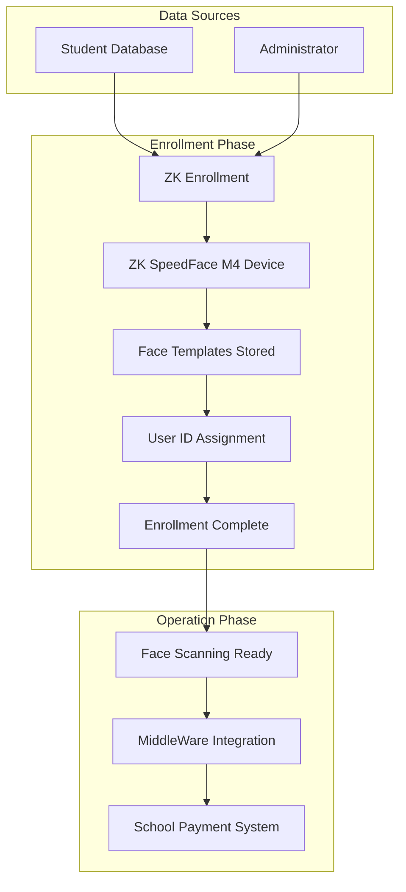

# Enrollment Workflow Visualization

## Complete Enrollment Process Flow



## Detailed Enrollment Steps

### Phase 1: Preparation
```
School Database ←→ ZK Enrollment Software
     ↓
Student List with IDs
[ID: 1001, Name: Wangari Maathai, Grade: 8]
[ID: 1002, Name: Jomo Kenyatta, Grade: 7]
[ID: 1003, Name: Chinua Achebe, Grade: 9]
```

### Phase 2: Face Enrollment
```
1. Administrator opens ZK software
2. Imports student list
3. For each student:
   a. Call student to device
   b. Capture face images
   c. Create biometric template
   d. Assign matching User ID
   e. Store in device memory
```

### Phase 3: Verification
```
ZK Device User IDs ←→ School System IDs ←→ Middleware Configuration
       1001                  1001                  1001
       1002                  1002                  1002
       1003                  1003                  1003
```

## The Critical Link: Student ID

### What Connects Everything:
```
Student's Face → Biometric Template → User ID → Payment Status
     ↓               ↓                   ↓           ↓
  [Face Data]   [ZK Device]        [School System]  [Payment Info]
```

### Example with Wangari Maathai:
```
1. Face Enrollment:
   Wangari's Face → ZK Device → User ID "1001"
   
2. Daily Operation:
   Wangari's Face → ZK Device → Attendance Log with "1001"
   
3. Payment Check:
   Middleware → School API: "GET /students/1001/fees"
   
4. Response:
   School System → {"student_id": "1001", "paid": true, ...}
   
5. Decision:
   Paid: true → Grant Access + Print Ticket
```

## Enrollment Verification Points

### Before Operation:
```
✓ All students enrolled in ZK device
✓ User IDs match school system exactly
✓ Face templates are high quality
✓ Network connectivity established
```

### During Operation:
```
✓ Face scans return correct User IDs
✓ Attendance logs contain correct IDs
✓ Middleware extracts IDs correctly
✓ School API returns data for IDs
```

## Common Enrollment Scenarios

### New Student Enrollment:
```
1. Add to school database (assign ID: 1006)
2. Enroll face in ZK device (use same ID: 1006)
3. Verify middleware can access payment data
4. Test face scan workflow
```

### Student ID Correction:
```
1. Identify mismatch (ZK: 001, School: 1001)
2. Correct ID in ZK device enrollment
3. Verify consistency across systems
4. Retest face scanning workflow
```

### Re-enrollment for Poor Quality:
```
1. Identify recognition issues
2. Delete old enrollment in ZK device
3. Re-enroll student with better images
4. Verify improved recognition
```

## Production vs. Development

### Production Environment:
```
Real Students → ZK Device Enrollment → User IDs → Middleware
     ↓              ↓                    ↓           ↓
  [Face Scan]   [Template]          [1001,1002]  [API Calls]
```

### Development Simulation:
```
Mock Data → Attendance Logs → Student IDs → Middleware
     ↓          ↓               ↓            ↓
  [JSON]   [POST /attendance]  [1001,1002]  [API Calls]
```

## Troubleshooting Enrollment Issues

### ID Mismatch:
```
Problem: ZK ID "001" ≠ School ID "1001"
Solution: Re-enroll with correct ID "1001"
```

### Recognition Failure:
```
Problem: Student face not recognized
Solution: 
1. Check enrollment quality
2. Re-enroll with better images
3. Ensure consistent lighting
```

### Payment Data Missing:
```
Problem: School API returns 404 for ID "1001"
Solution:
1. Verify student exists in school system
2. Check ID format consistency
3. Confirm API integration
```

The enrollment process is the foundation that makes the entire face scanning to payment status connection possible!