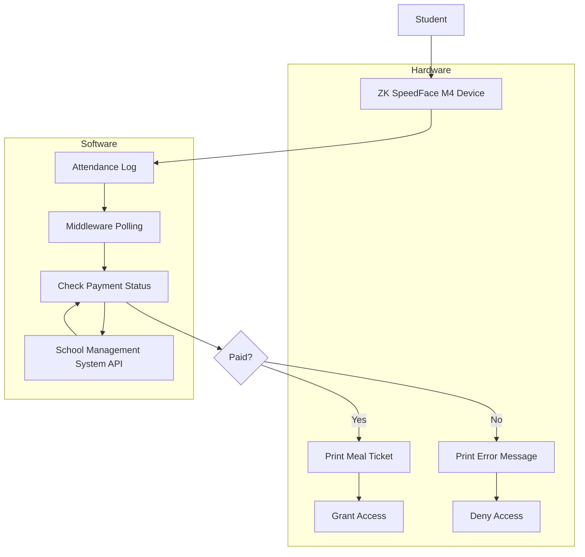

# ZK Middleware Workflow

## System Architecture



## Data Flow

1. **Student Face Scan**
   - Student approaches ZK device
   - Face is recognized and matched to enrolled template
   - Device creates attendance log with student ID

2. **Log Processing**
   - Middleware polls device every 3 seconds
   - Retrieves new attendance logs
   - Extracts student ID from each log

3. **Payment Verification**
   - Middleware calls school API with student ID
   - API returns payment status and student details
   - Middleware processes response

4. **Access Control**
   - If paid: Print meal ticket + grant access
   - If unpaid: Print error message + deny access

5. **Feedback**
   - Display message on device screen
   - Print physical ticket/receipt
   - Log transaction for reporting

## Sample Data Structures

### Attendance Log (from ZK device)
```json
{
  "user_id": "1001",
  "timestamp": "2025-10-24 14:30:00",
  "status": 1,
  "punch": 1
}
```

### Payment Status Response (from School API)
```json
{
  "student_id": "1001",
  "name": "Wangari Maathai",
  "grade": "Grade 8",
  "class": "8A",
  "paid": true,
  "details": "Lunch payment confirmed",
  "amount": 150.00,
  "balance": 0.00,
  "last_payment_date": "2025-10-20"
}
```

### Meal Ticket (Printed Output)
```
CRAWFORD INTERNATIONAL
CAFETERIA
------------------------------
Student: Wangari Maathai
ID: 1001
Lunch - R150.00
Date: 2025-10-24 14:30:00
------------------------------
Thank you. Enjoy your meal!
```

### Error Ticket (Printed Output)
```
ACCESS DENIED
------------------------------
Fee not paid for today's meal
------------------------------
Please contact administration.
```