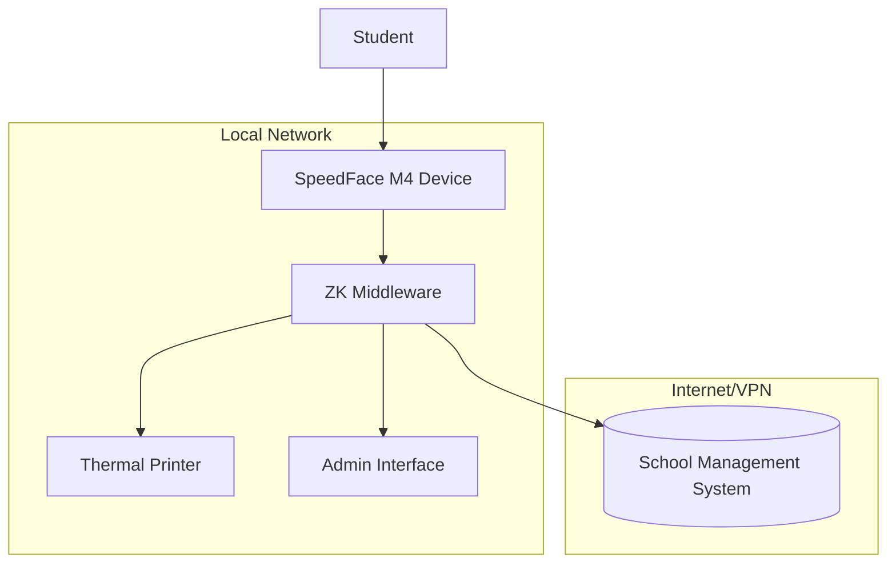

# System Architecture

## Component Descriptions

### 1. SpeedFace M4 Device
- Captures student face biometrics
- Sends attendance logs to middleware
- Displays messages to students

### 2. ZK Middleware
- Python application that connects to the device
- Polls for attendance logs or uses live capture
- Queries school management system for payment status
- Controls thermal printer for ticket printing
- Provides admin web interface

### 3. School Management System
- REST API that provides student payment information
- Returns payment status for queried students

### 4. Thermal Printer
- Prints tickets for students who have paid
- Prints error messages for students who haven't paid

### 5. Admin Interface
- Web interface for monitoring system status
- Allows testing of printer and device functions
- Shows recent activity logs

## Data Flow

1. Student approaches SpeedFace M4 device
2. Device captures face and generates attendance log
3. Middleware polls device and receives log
4. Middleware extracts student ID from log
5. Middleware queries school management system API
6. If paid:
   - Middleware sends print job to thermal printer
   - Middleware optionally displays success message on device
7. If not paid:
   - Middleware displays error message on device
   - Middleware optionally prints error ticket
8. All actions are logged for auditing